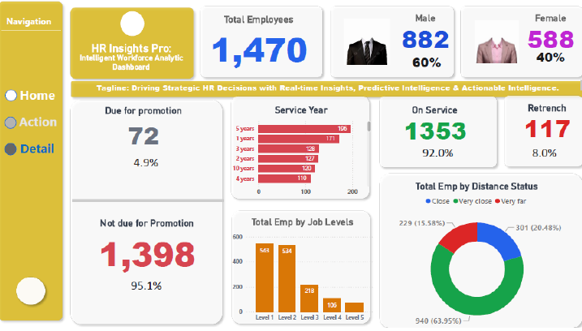
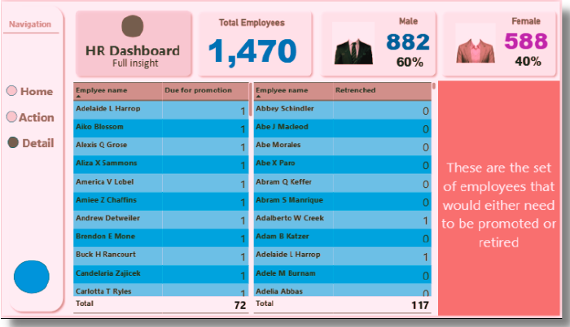
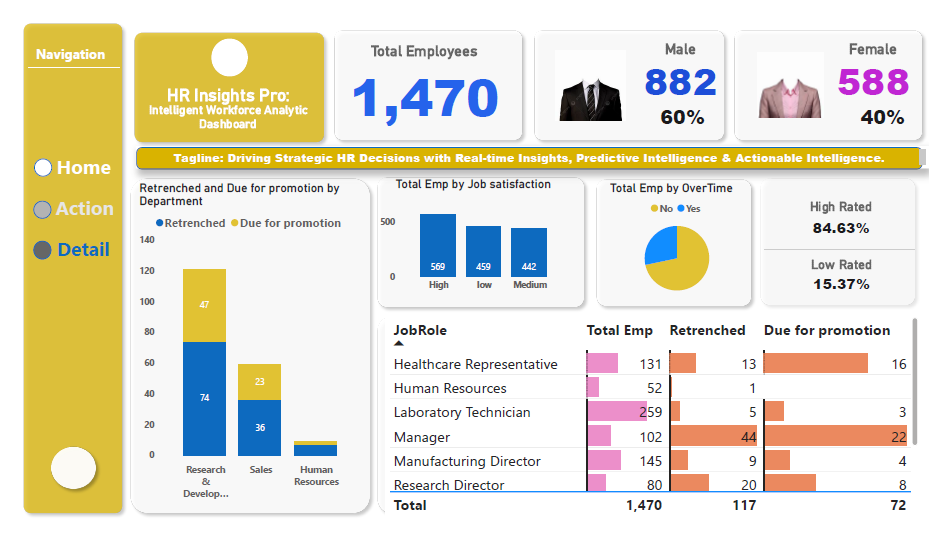

# HR Insights Pro - Intelligent Workforce Analytics Dashboard


**Power BI Dashboard** | **HR Analytics** | **People Analytics**

---

## 📋 Project Overview

**HR Insights Pro** is a clean, modern, and interactive **Power BI dashboard** designed to support strategic HR decision-making.

It delivers real-time insights into workforce demographics, promotion pipelines, retrenchment risks, departmental performance, and employee satisfaction.

---

## ✨ Key Features

- Executive-level KPI Overview (1,470 employees)
- Promotion Pipeline Tracking (72 employees)
- Retrenchment Risk Analysis (117 employees)
- Department & Role Performance Breakdown
- Employee Performance & Job Satisfaction Metrics

---

## 🎯 Key Insights

- **92%** of the workforce is currently active
- Majority of employees are in **Job Level 1 & 2**
- **Research & Development** has the highest retrenchment risk (**74 employees**)
- **Manager** role has the largest promotion backlog (**22 employees**)
- **84.63%** of employees are rated High
- Strong job satisfaction with **569 employees** in the High category

---

## 📸 Dashboard Screenshots





---

## 🛠️ Technologies Used

- **Microsoft Power BI Desktop**
- **DAX** (Data Analysis Expressions)
- **Power Query**
- **Microsoft Excel**
- **Canva** (for presentation design & visuals)
- Custom Visuals

---

## 📁 Repository Structure

```bash
HR-INSIGHTS-PRO-Intelligent-Workforce-Analytics-Dashboard/
├── HR Insights Pro.pbix
├── Data/
│   ├── HR Analytics Data.csv
│   ├── HR Employee Data.csv
│   └── Clustered HR Data/
├── Documentation/
│   └── HR Insight Pro Presentation.pdf
├── Screenshots/
└── README.md

🚀 How to Use

Open HR Insights Pro.pbix using Power BI Desktop
Explore the interactive dashboard


👤 Author
Boniface Anuforo
Data Analyst

GitHub: https://github.com/bcanuforo/HR-INSIGHTS-PRO-Intelligent-Workforce-Analytics-Dashboard
LinkedIn: www.linkedin.com/in/boniface-anuforo-34b935219
